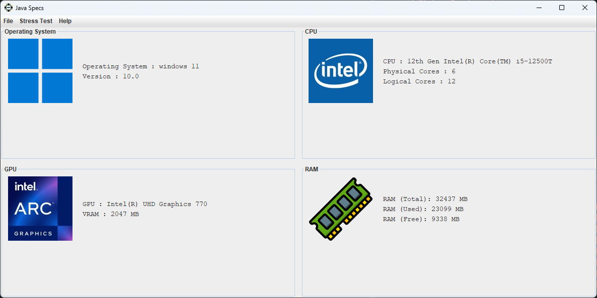

# Specs

A Java application that displays detailed information about your PC's hardware.



### Features:

CPU Details :View your processor's model, physical and logical core count.  
GPU Information : See your graphics processor name and VRAM capacity.  
RAM Usage : Shows total, used, and free memory, without cached files.  
Operating System : Displays OS name and version.  
Auto Refresh : Set intervals to automatically update displayed information.

# Minimum Requirements :

🖥️ OS : Windows 10 or better / Linux 5.15 or better / Mac OS 11 or better (minimum for JDK 21)  
⚙️ CPU : 1 Core 1 GHZ 64 bit CPU  
💾 RAM : 2 GB of RAM  
💿 Storage : 512 MB of free space  
☕ Java : JDK 21 or better (if you use the .jar version)

# Project Status :

### Legend :
- ✅ Yes
- ❌ No
- ⚠️ Partial or Special Case
- 🟧 Not Available/Unknown

| OS            | Launch     | Installer     | Standalone Version  | Icon  | Stress Test  | OS | CPU  | RAM  | VRAM  |
|---------------|------------|---------------|---------------------|-------|--------------|----|------|------|-------|
| Windows 10    | ✅        | ✅            | ✅                  | ✅    | ✅          | ✅ | ✅  | ✅   | ✅   |
| Windows 11    | ✅        | ✅            | ✅                  | ✅    | ✅          | ✅ | ✅  | ✅   | ✅   |
| Arch Linux    | ✅        | 🟧            | ✅                  | ✅    | ✅          | ✅ | ✅  | ✅   | ✅   |
| Ubuntu        | ✅        | ✅            | ✅                  | ✅    | ✅          | ✅ | ✅  | ✅   | ✅   |
| Debian        | ✅        | ✅            | ✅                  | ✅    | ✅          | ✅ | ✅  | ✅   | ✅   |
| Gentoo Linux  | ✅        | 🟧            | ✅                  | ✅    | ✅          | ✅ | ✅  | ✅   | ✅   |
| Fedora        | ✅        | ⚠️            | ✅                  | ✅    | ✅          | ✅ | ✅  | ✅   | ✅   |
| Mac OS        | ✅        | ✅            | ✅                  | ✅    | ✅          | ✅ | ✅  | ✅   | ✅   |

# Planned Features and Updates :

- RPM installer for Fedora.
- Metadata for the installer.

# dependency :

## glxinfo :

To enable GPU and VRAM information retrieval on Linux, this program requires `glxinfo`. Below are the instructions for installing `glxinfo` on Debian, Ubuntu, Fedora, Arch Linux, and Gentoo.

### Debian / Ubuntu :
On Debian or Ubuntu, `glxinfo` is part of the `mesa-utils` package :
```bash
sudo apt-get update && sudo apt-get upgrade
sudo apt-get install mesa-utils
```
### Fedora :
On Fedora, you can install glxinfo with the mesa-demos package :
```bash
sudo dnf install mesa-demos
```
### Arch Linux :
On Arch Linux, glxinfo is provided by the mesa-demos package :
```bash
sudo pacman -S mesa-demos
```
### Gentoo :
On Gentoo, you can install glxinfo by emerging the mesa-progs package :
```
sudo emerge --ask mesa-progs -av
```
### Verifying the Installation :
To confirm that glxinfo is installed correctly, run :
```bash
glxinfo | grep "OpenGL version"
```
If glxinfo returns OpenGL version information, the installation was successful.