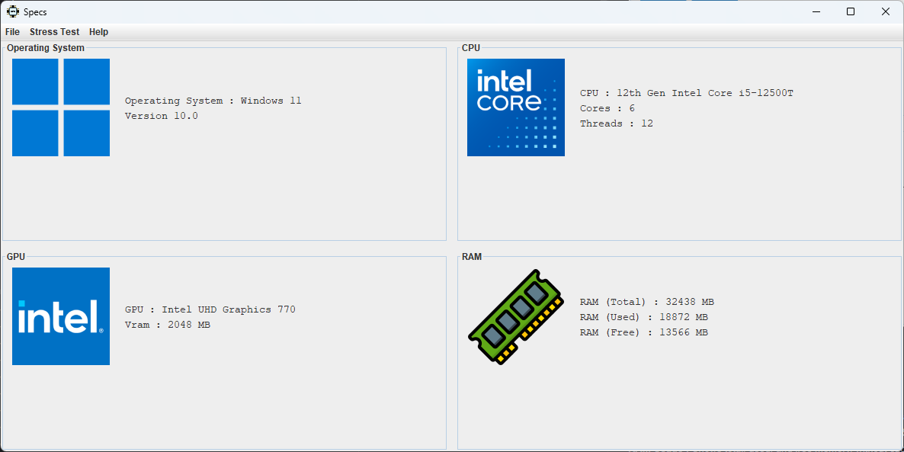

# Specs :

### A Java application that displays detailed information about your PC's hardware.



# Features :

**CPU Details :** View your processor's model, physical and logical core count.  
**GPU Information :** See your graphics processor name and VRAM capacity.  
**RAM Usage :** Shows total, used, and free memory, without cached files.  
**Operating System :** Displays OS name and version.  
**Auto Refresh :** Set intervals to automatically update displayed information.

# Minimum Requirements :

🖥️ OS : Windows 7 or better / Linux 4.4 or better / Mac OS 10.11 or better  
⚙️ CPU : 64 bits CPU  
💾 RAM : 512 MO of RAM  
💿 Storage : 512 Mo of free space  
☕ Java : JDK 17 or better

# Validation :

- the validation feature is a feature that allows you to display information from multiple PCs to create statistics.

- This feature requires a server to be used.  
- currently there is no official server available, but you can create one by using the guide [how to create you own Specs Server](https://github.com/enzo-quirici/Specs-Server/).

# dependency :

## libjpeg turbo 8 :

This is a dependency that may be necessary to install the .deb file on certain Linux distributions based on Debian.

### Debian :

```bash
wget http://mirrors.kernel.org/ubuntu/pool/main/libj/libjpeg-turbo/libjpeg-turbo8_2.1.2-0ubuntu1_amd64.deb  
sudo apt install ./libjpeg-turbo8_2.1.2-0ubuntu1_amd64.deb
```

## glxinfo :  

- GLXINFO has been replaced with OSHI GLXINFO is now optional.  

- To enable GPU and VRAM information retrieval on Linux, this program requires `glxinfo`. Below are the instructions for installing `glxinfo` on Debian, Ubuntu, Fedora, Arch Linux, and Gentoo.  

### Debian / Ubuntu :
On Debian or Ubuntu, `glxinfo` is part of the `mesa-utils` package :
```bash
sudo apt-get update
sudo apt-get install mesa-utils
```
### Fedora :
On Fedora, you can install glxinfo with the mesa-demos package :
```bash
sudo dnf install mesa-demos
```
### Arch Linux :
On Arch Linux, glxinfo is provided by the mesa-demos package :
```bash
sudo pacman -S mesa-demos
```
### Gentoo :
On Gentoo, you can install glxinfo by emerging the mesa-progs package :
```
sudo emerge --ask mesa-progs -av
```
### Verifying the Installation :
To confirm that glxinfo is installed correctly, run :
```bash
glxinfo | grep "OpenGL version"
```
If glxinfo returns OpenGL version information, the installation was successful.
